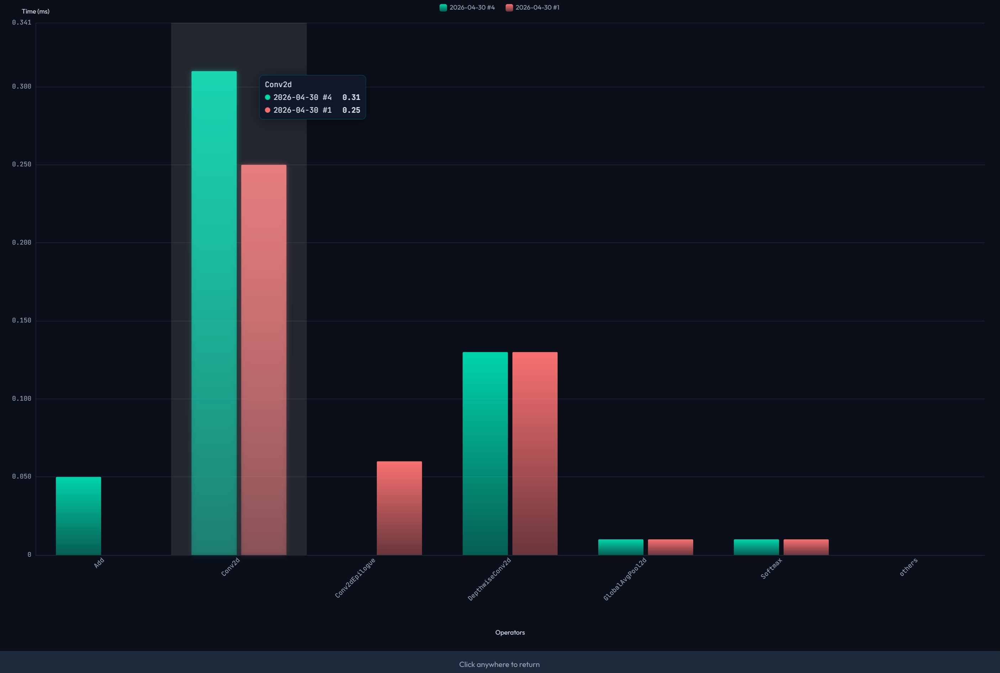

# 📊 Benchmark Data Management System

> 🤖 Built with AI via vibe coding.

A fully offline, browser-based benchmark performance management and visualization tool. No server required — just open in your browser and start analyzing! 🚀

## ✨ Features

- 📁 **Data Management** — Import/export JSON backups, view per-benchmark statistics (Arch/Config/Record counts), clear data with optional backup
- 📝 **Data Operations** — Full CRUD for benchmark records across a 3-level hierarchy (Benchmark → Architecture → Configuration). Supports custom extra fields per Architecture with int/float/string types. Paginated record table with search, sort, inline edit, and field filtering
- 📈 **Performance Trends** — Multi-line Canvas charts with animated drawing, MAX/MIN point highlighting, hover tooltips with collision-aware positioning, and fullscreen view. Click table header radio buttons to instantly visualize any numeric field over time
- 📊 **Operators Comparison** — Compare operators performance across different runs with dual-axis bar charts. Supports both single-date and compare-dates modes with interactive tooltips
- 📤 **XLSX Import** — Load benchmark data from Excel files (`.xlsx`), automatically parse Summary Data and Operators Data sheets with automatic type detection
- 🎨 **Modern UI** — Dark theme with smooth animations, responsive design, and offline fonts

## Data Hierarchy

| Step | Name | Example |
|------|------|---------|
| 1 | **Benchmark** | resnet50, llama2-7b |
| 2 | **Architecture** | 16T r2p1, 8T r3p0 |
| 3 | **Configuration** | fp16, int8 per-layer symm |

## Data Structure

```json
{
  "benchmark_name": {
    "arch_name": {
      "config_name": [
        {
          "date": "2026-04-19",
          "duration": 123.456,
          "extras": {
            "field_id": { "name": "MAC Utilization (%)", "type": "float", "value": 57.1 }
          }
        }
      ]
    }
  }
}
```

## XLSX Import

1. **Summary Data** sheet: first row as keys, second row as values
   - `total time` or `inference time` → `duration` field
   - Other keys → custom extra fields
   - Automatic type detection (int/float/string)
   - Deduplication: skips duplicate records

2. **Operators Data** sheet: third row and beyond
   - Column A: operator names
   - Column B: time (ms)
   - Column C: ratio (%)
   - Stored separately for operator comparison

## Operators Comparison



- **Side-by-side comparison** of two different runs
- **Unified X-axis** showing common operators
- **Time (ms)** on left Y-axis (green/red bars)
- **Ratio (%)** in tooltip only (no visual clutter)
- **Interactive tooltips** with mouse-over information
- **Fullscreen mode** for detailed analysis

## Usage

1. Open `index.html` in a browser (no server required for basic use)
2. **Data Operations**: Select Benchmark → Arch → Configuration → Add/Edit records
3. **XLSX Import**: Click "Load External XLSX" to import data from Excel files
4. **Performance Trends**: Select Benchmark → choose Arch/Config lines → pick Y-axis metric → Draw Chart. Or click radio buttons in the Existing Records table headers for instant visualization
5. **Operators Comparison**: Select Benchmark → Arch → Configuration → choose one or two dates → Draw Chart. Or use the radio/checkbox buttons in the Existing Records table
6. **Data Management**: Import/Export JSON backup, view per-benchmark statistics

## Storage

All data stored in browser **IndexedDB** — works **fully offline** with no external dependencies.

## Dependencies

- **SheetJS** (`xlsx.full.min.js`) — Offline XLSX parsing
- **Choices.js** — Customizable select boxes with search
- **SweetAlert2** — Beautiful popup dialogs
- **Fonts** (embedded locally):
  - Outfit (sans-serif)
  - JetBrains Mono (monospace)

## Notes

- **Offline only**: No network requests or external dependencies
- **Responsive design**: Adapts to different screen sizes
- **Dark theme**: Optimized for long sessions and reduced eye strain
- **Automatic deduplication**: Prevents duplicate records during XLSX import
- **Interactive charts**: Mouse hover for tooltips, click anywhere to exit fullscreen
