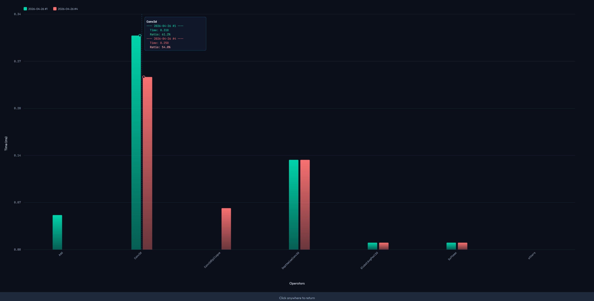

# Performance Manager

> 🚀 Built with AI via vibe coding.

A fully offline, browser-based benchmark performance management and visualization tool.

## Features

- **Data Management** — Import/export JSON, per-benchmark statistics (Arch/Config/Record counts)
- **Data Operations** — Full CRUD for benchmark records across a 3-level hierarchy (Benchmark → Architecture → Configuration). Supports custom extra fields per Architecture. Paginated record table with search, sort, and inline edit
- **Data Visualization** — Multi-line Canvas charts with animated drawing, MAX/MIN point highlighting, hover tooltips with collision-aware positioning, and fullscreen view
- **XLSX Import** — Load benchmark data from Excel files (`.xlsx`), automatically parse Summary Data and Operators Data sheets
- **Operators Comparison** — Compare operators performance across different runs with dual-axis bar charts

## Data Hierarchy

| Step | Name | Example |
|------|------|--------|
| 1 | **Benchmark** | resnet50, llama2-7b |
| 2 | **Architecture** | 16T r2p1, 8T r3p0 |
| 3 | **Configuration** | fp16, int8 per-layer symm |

## Data Structure

```json
{
  "benchmark_name": {
    "arch_name": {
      "config_name": [
        {
          "date": "2026-04-19",
          "duration": 123.456,
          "extras": {
            "field_id": { "name": "MAC Utilization (%)", "type": "float", "value": 57.1 }
          }
        }
      ]
    }
  }
}
```

## XLSX Import

1. **Summary Data** sheet: first row as keys, second row as values
   - `total time` or `inference time` → `duration` field
   - Other keys → custom extra fields
   - Automatic type detection (int/float/string)
   - Deduplication: skips duplicate records

2. **Operators Data** sheet: third row and beyond
   - Column A: operator names
   - Column B: time (ms)
   - Column C: ratio (%)
   - Stored separately for operator comparison

## Operators Comparison



- **Side-by-side comparison** of two different runs
- **Unified X-axis** showing common operators
- **Time (ms)** on left Y-axis (green/red bars)
- **Ratio (%)** in tooltip only (no visual clutter)
- **Interactive tooltips** with mouse-over information
- **Fullscreen mode** for detailed analysis

## Usage

1. Open `index.html` in a browser (no server required for basic use)
2. **Data Operations**: Select Benchmark → Arch → Configuration → Add/Edit records
3. **XLSX Import**: Click "Load External XLSX" to import data from Excel files
4. **Data Visualization**: Select Benchmark → choose Arch/Config lines → pick Y-axis metric → Draw Chart
5. **Operators Comparison**: Select Benchmark → Arch → Configuration → choose two dates → Draw Chart
6. **Data Management**: Import/Export JSON backup, view per-benchmark statistics

## Storage

All data stored in browser **IndexedDB** — works **fully offline** with no external dependencies.

## File Structure

```
perf_manager/
├── index.html            # Home page
├── html/
│   ├── data.html        # Data management
│   ├── data-op.html     # Data operations + XLSX import
│   └── chart.html       # Data visualization + Operators comparison
├── css/styles.css       # All styles (dark theme, animations)
├── fonts/               # JetBrains Mono + Outfit (offline)
├── js/
│   ├── db.js            # IndexedDB wrapper
│   ├── data.js          # Import/export, statistics
│   ├── data-op.js       # CRUD logic, pagination, XLSX import
│   ├── chart.js         # Canvas rendering, animations, tooltips
│   └── xlsx.full.min.js # SheetJS (offline, for XLSX parsing)
├── test_case/           # Sample XLSX files for testing
└── compare_operators.jpg # Operators comparison chart example
```

## Dependencies

- **SheetJS** (`xlsx.full.min.js`) — Offline XLSX parsing
- **Google Fonts** (embedded locally):
  - Outfit (sans-serif)
  - JetBrains Mono (monospace)

## Notes

- **Offline only**: No network requests or external dependencies
- **Responsive design**: Adapts to different screen sizes
- **Dark theme**: Optimized for long sessions and reduced eye strain
- **Automatic deduplication**: Prevents duplicate records during XLSX import